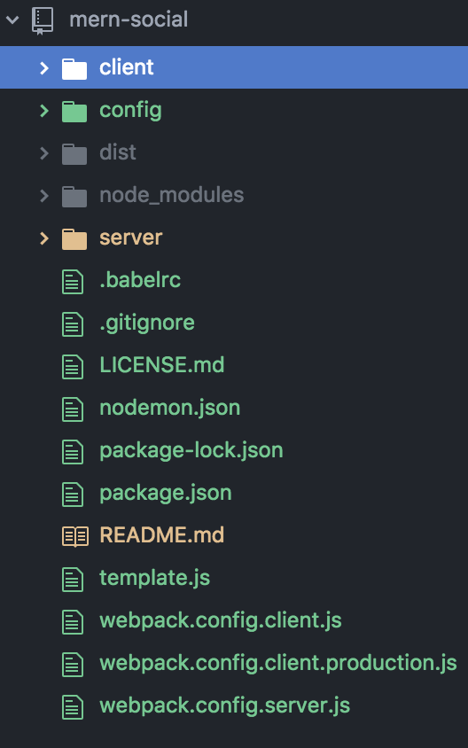

## User Documentation

A quick informative description of the project for use by the end user.

### Project Desciption

This project was created to benefit working medical professionals and their patients through enhanced communication between the two parties. The intended outcome of the project is for patients to receive more immediate response from a physician (or group of physicians) based on ongoing treatments or medical issues, and for a physician to receive more accurate and immediate response from patients, which may give them the ability to improve patient care. Through secure methods of information transfer, patient care no longer must be limited to clinical visits, but hopefully can be done from the comfort of home in some instances, especially when a patient may be at risk of picking up or spreading pathogens at a physical clinic. Through a our medical social network, patient care can be practiced in a safer and more efficient manner.

### How to obtain and Run Software

There is no physical software necessary to run our system, users simply need to navigate to the url at [https://medicalsocialnetwork.herokuapp.com/](https://medicalsocialnetwork.herokuapp.com/)

### How to use the software

The use of the software is similar to that of any other social media website, except that because of the nature of the data on this social media platform, further steps must be taken to ensure the proper indentity of both patient and doctor. For doctors, `#####` will be needed upon the account creating process to confirm credentials and identity, wheras on the patient side `#####` will be needed. While at this stage of the production process the tools are not yet created for these processes and adding of connections between patients and doctors, these descriptions will be added further into the production cycle.

### Reporting a Bug

To report a bug, simply navigate to the "report a problem" link towards the bottom of any page, which will take you to a report form for you to fill out. Please remember to include a good descriptive title at the top of the report, as well as strong descriptions of where on the site you encountered the problem and what exactly the problem entailed within the report itself. If the bug persist or prevents you from doing anything within the site (eg. more than a cosmetic bug) select the appropriate boxes beneath the report before hitting submit.

## Documentation for Developers

## To obtain source code:
Latest stable version will always be master, so clone the repo and pull that branch.

# To run:
1.) Clone the repository to your local machine

2.) In terminal, cd MedicalSocialNetwork/

3.) run npm install

4.) run npm run dev

5.) point your browser to [http://localhost:3000](http://localhost:3000)

# Directory Structure

# To run test:
Make sure the project is running from 'medicalSocialNetwork'
Open another terminal and cd into 'client'
`npm run test`

# Automated weekly builds
Our software uses Travis CI to perform continious integration.  It will run the build and tests each time a commit is made to master.  

# Releasing a new version of the software

We will be releasing new versions of our website week to week, and will provide updated zip files with corresponding version numbers to make it clear which build is our most current on git. We will likely have main and sub releases on a regular basis as we continue to build or application, with new builds being announced on old builds so that individuals can stay up to date.

# Accessing the list of bugs
[Click here to report/access bugs](https://github.com/jazzlynpulley/medicalSocialNetworkRework/issues)

# MedicalSocialNetwork
ESOF423

Repository for Medical Social Network project

Medical Social network The goal of this project is to create a social networkwhere you can choose to connect ("friend") with your clinicians to share information with them. Following are the requirement:

1.Ability for clinicians to register after verifying their credentials.

2.Ability for patients to register.

3.Ability for a patient friend one or more clinicians.

4.Ability for the clinicians to “friend” their patients.

5.Ability for patients to share information that they think is necessary with the clinician.

6.Ability for clinicians to share information with the patients.

7.Use a secured data host and a 3rd party electronic health care integrator(Google Cloud platform healthcare API may be able to theoretically solve both problems
